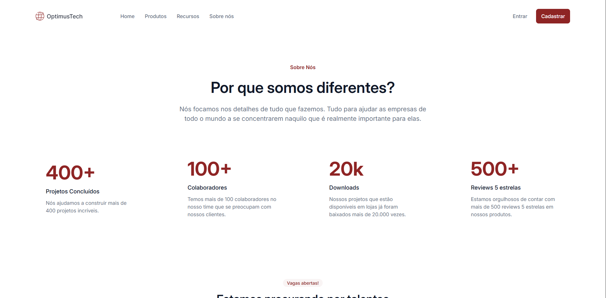

# 🚀 OptimusTech Website



Este é um projeto de desenvolvimento web focado na criação de uma landing page institucional moderna, limpa e responsiva para a empresa fictícia **OptimusTech**. O site apresenta a cultura da empresa, métricas de sucesso, vagas em aberto e depoimentos de colaboradores.

---

Link do Projeto Hospedado:
* Como o site não possui responsividade, é recomendado navegar através da resolução 1920x1080. 
* O site está publicado e disponível para visualização online através do GitHub Pages:

Visite o site da OptimusTec: https://vithorsantos.github.io/OptimusTech-website/

Desenvolvido por VithorSantos

## Como Executar o Projeto Localmente

1. Faça o clone deste repositório:
   ```bash
   git clone [https://github.com/vithorsantos/optimustech-website.git](https://github.com/vithorsantos/optimustech-website.git)

2. Abra o arquivo index.html diretamente no seu navegador, ou utilize a extensão Live Server no VS Code para visualizar as alterações em tempo real.

## Tecnologias Utilizadas

O projeto foi construído utilizando tecnologias web fundamentais, priorizando uma estrutura semântica e estilização moderna:

* **HTML5:** Estruturação semântica de todo o conteúdo.
* **CSS3:** Estilização baseada em variáveis CSS (Custom Properties) para consistência de cores e tipografia.
* **Metodologia BEM (Block Element Modifier):** Utilizada na organização de todas as classes CSS para garantir código limpo, modular e de fácil manutenção.
* **Fontes Google (Inter):** Tipografia moderna e otimizada para legibilidade.

---

